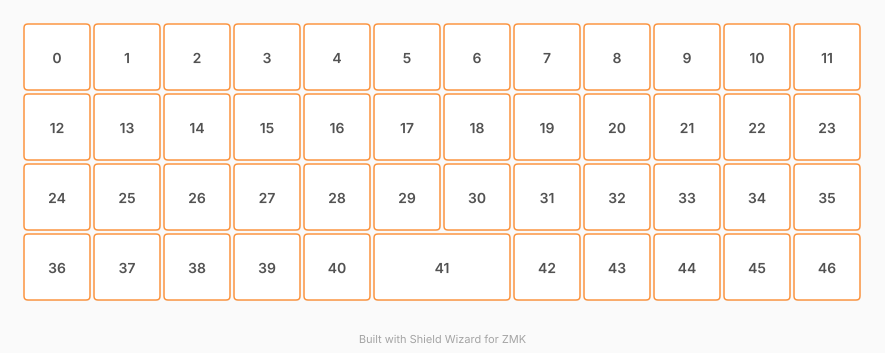

# ZMK Configuration for AvyOrtho

*Generated by Shield Wizard for ZMK*



Download compiled firmware from the Actions tab. <https://zmk.dev/docs/user-setup#installing-the-firmware>

Edit your keymap <https://zmk.dev/docs/keymaps>.
User keymap is located at [`config/avyortho.keymap`](config/avyortho.keymap).

-----

<details>
<summary>
Shield Wizard Debug Information
</summary>

In case of broken configuration, here is the Shield Wizard internal data used to generate this configuration:

Commit: 84a348b08cf4fec4a5441a46147e9a345b10ffab

```json
{"name":"avyortho","shield":"avyortho","dongle":false,"modules":[],"layout":[{"id":"01M2K1HXQFR7YPQB90R978571B","part":0,"row":0,"col":0,"w":1,"h":1,"x":0,"y":0,"r":0,"rx":0,"ry":0},{"id":"01M2K1HXQFNEVPNAYS29BYJJW8","part":0,"row":0,"col":1,"w":1,"h":1,"x":1,"y":0,"r":0,"rx":0,"ry":0},{"id":"01M2K1HXQFD94MW80S6J8425YF","part":0,"row":0,"col":2,"w":1,"h":1,"x":2,"y":0,"r":0,"rx":0,"ry":0},{"id":"01M2K1HXQFJJ9QJHHK85WYA2W3","part":0,"row":0,"col":3,"w":1,"h":1,"x":3,"y":0,"r":0,"rx":0,"ry":0},{"id":"01M2K1HXQF47QBN2BTKW95A6EB","part":0,"row":0,"col":4,"w":1,"h":1,"x":4,"y":0,"r":0,"rx":0,"ry":0},{"id":"01M2K1HXQFFJMGKJ93RXMMCRZF","part":0,"row":0,"col":5,"w":1,"h":1,"x":5,"y":0,"r":0,"rx":0,"ry":0},{"id":"01M2K1HXQFXTBCF3F483QZ3DWH","part":0,"row":0,"col":6,"w":1,"h":1,"x":6,"y":0,"r":0,"rx":0,"ry":0},{"id":"01M2K1HXQFES5VP0FGDZN5G67N","part":0,"row":0,"col":7,"w":1,"h":1,"x":7,"y":0,"r":0,"rx":0,"ry":0},{"id":"01M2K1HXQFH108G6NDXA6HXXFM","part":0,"row":0,"col":8,"w":1,"h":1,"x":8,"y":0,"r":0,"rx":0,"ry":0},{"id":"01M2K1HXQFDRNQFV71ZVVPMMBT","part":0,"row":0,"col":9,"w":1,"h":1,"x":9,"y":0,"r":0,"rx":0,"ry":0},{"id":"01M2K1HXQFY0CX6EDHSTAB1SPT","part":0,"row":0,"col":10,"w":1,"h":1,"x":10,"y":0,"r":0,"rx":0,"ry":0},{"id":"01M2K1HXQF2B6RJRVMW5RH3KTX","part":0,"row":0,"col":11,"w":1,"h":1,"x":11,"y":0,"r":0,"rx":0,"ry":0},{"id":"01M2K1HXQFD5FKJM3WVNFYV6YS","part":0,"row":1,"col":0,"w":1,"h":1,"x":0,"y":1,"r":0,"rx":0,"ry":0},{"id":"01M2K1HXQF1GT9NZ3W49YG7N6D","part":0,"row":1,"col":1,"w":1,"h":1,"x":1,"y":1,"r":0,"rx":0,"ry":0},{"id":"01M2K1HXQFH532CBS22S52BJ3E","part":0,"row":1,"col":2,"w":1,"h":1,"x":2,"y":1,"r":0,"rx":0,"ry":0},{"id":"01M2K1HXQFJJ59TDMBMQQMGEPB","part":0,"row":1,"col":3,"w":1,"h":1,"x":3,"y":1,"r":0,"rx":0,"ry":0},{"id":"01M2K1HXQGH2812614QHZJWV91","part":0,"row":1,"col":4,"w":1,"h":1,"x":4,"y":1,"r":0,"rx":0,"ry":0},{"id":"01M2K1HXQGR01CBVBE29TJ2351","part":0,"row":1,"col":5,"w":1,"h":1,"x":5,"y":1,"r":0,"rx":0,"ry":0},{"id":"01M2K1HXQGVPB8CZSEN6C0GQQS","part":0,"row":1,"col":6,"w":1,"h":1,"x":6,"y":1,"r":0,"rx":0,"ry":0},{"id":"01M2K1HXQG6CHV1ZVPDE2NVJP3","part":0,"row":1,"col":7,"w":1,"h":1,"x":7,"y":1,"r":0,"rx":0,"ry":0},{"id":"01M2K1HXQG98AJJ1SYG7A8QAD5","part":0,"row":1,"col":8,"w":1,"h":1,"x":8,"y":1,"r":0,"rx":0,"ry":0},{"id":"01M2K1HXQGCKWEMS0NECYN9ZP6","part":0,"row":1,"col":9,"w":1,"h":1,"x":9,"y":1,"r":0,"rx":0,"ry":0},{"id":"01M2K1HXQGPD7Z0D5ZYHVSCKMX","part":0,"row":1,"col":10,"w":1,"h":1,"x":10,"y":1,"r":0,"rx":0,"ry":0},{"id":"01M2K1HXQG84KM8GW6DXX9W7R6","part":0,"row":1,"col":11,"w":1,"h":1,"x":11,"y":1,"r":0,"rx":0,"ry":0},{"id":"01M2K1HXQGDGT7K4ENCTCCF3CZ","part":0,"row":2,"col":0,"w":1,"h":1,"x":0,"y":2,"r":0,"rx":0,"ry":0},{"id":"01M2K1HXQGFMMCHRW6WRX4JAGB","part":0,"row":2,"col":1,"w":1,"h":1,"x":1,"y":2,"r":0,"rx":0,"ry":0},{"id":"01M2K1HXQGRY6MT6EY70Z6RNRA","part":0,"row":2,"col":2,"w":1,"h":1,"x":2,"y":2,"r":0,"rx":0,"ry":0},{"id":"01M2K1HXQGEBTE1WXF5XH4W9CH","part":0,"row":2,"col":3,"w":1,"h":1,"x":3,"y":2,"r":0,"rx":0,"ry":0},{"id":"01M2K1HXQGTWY8VYTRZY216GMH","part":0,"row":2,"col":4,"w":1,"h":1,"x":4,"y":2,"r":0,"rx":0,"ry":0},{"id":"01M2K1HXQG7X80VK9DTXW3BCC8","part":0,"row":2,"col":5,"w":1,"h":1,"x":5,"y":2,"r":0,"rx":0,"ry":0},{"id":"01M2K1HXQG0WHBDQRHT3EGNJ3F","part":0,"row":2,"col":6,"w":1,"h":1,"x":6,"y":2,"r":0,"rx":0,"ry":0},{"id":"01M2K1HXQGRBY3SYYVG4619ZNG","part":0,"row":2,"col":7,"w":1,"h":1,"x":7,"y":2,"r":0,"rx":0,"ry":0},{"id":"01M2K1HXQGVTW8H2DZQSJ1VFB3","part":0,"row":2,"col":8,"w":1,"h":1,"x":8,"y":2,"r":0,"rx":0,"ry":0},{"id":"01M2K1HXQG3GR7RDNN2V32JHCF","part":0,"row":2,"col":9,"w":1,"h":1,"x":9,"y":2,"r":0,"rx":0,"ry":0},{"id":"01M2K1HXQG9CTSPHGMY5EPG84F","part":0,"row":2,"col":10,"w":1,"h":1,"x":10,"y":2,"r":0,"rx":0,"ry":0},{"id":"01M2K1HXQG2MNAG6M0QJY71ZER","part":0,"row":2,"col":11,"w":1,"h":1,"x":11,"y":2,"r":0,"rx":0,"ry":0},{"id":"01M2K1HXQGPQK4PWQW0T8Z60CK","part":0,"row":3,"col":0,"w":1,"h":1,"x":0,"y":3,"r":0,"rx":0,"ry":0},{"id":"01M2K1HXQGWTRMJ7NWJ5YMSRXK","part":0,"row":3,"col":1,"w":1,"h":1,"x":1,"y":3,"r":0,"rx":0,"ry":0},{"id":"01M2K1HXQG21GWYN4C0P3YYPS0","part":0,"row":3,"col":2,"w":1,"h":1,"x":2,"y":3,"r":0,"rx":0,"ry":0},{"id":"01M2K1HXQGT6HJ9TXGEE43CBSM","part":0,"row":3,"col":3,"w":1,"h":1,"x":3,"y":3,"r":0,"rx":0,"ry":0},{"id":"01M2K1HXQGSMQ3E66HC769Z8VW","part":0,"row":3,"col":4,"w":1,"h":1,"x":4,"y":3,"r":0,"rx":0,"ry":0},{"id":"01M2K1HXQG1XND91WVJC6NSRK2","part":0,"row":3,"col":5,"w":2,"h":1,"x":5,"y":3,"r":0,"rx":0,"ry":0},{"id":"01M2K1HXQGKWGSSY9GV5M2DZZ9","part":0,"row":3,"col":7,"w":1,"h":1,"x":7,"y":3,"r":0,"rx":0,"ry":0},{"id":"01M2K1HXQGF5PJE15YN85DR311","part":0,"row":3,"col":8,"w":1,"h":1,"x":8,"y":3,"r":0,"rx":0,"ry":0},{"id":"01M2K1HXQGA2W5DZ8S1BGVS48X","part":0,"row":3,"col":9,"w":1,"h":1,"x":9,"y":3,"r":0,"rx":0,"ry":0},{"id":"01M2K1HXQG7937VVRP17T23EWF","part":0,"row":3,"col":10,"w":1,"h":1,"x":10,"y":3,"r":0,"rx":0,"ry":0},{"id":"01M2K1HXQGPR36SD9SS00P2VR1","part":0,"row":3,"col":11,"w":1,"h":1,"x":11,"y":3,"r":0,"rx":0,"ry":0}],"parts":[{"name":"unibody","controller":"xiao_ble_plus","pins":{"d0":{"usage":"kscan","kscan":"01M2K1JPCMGSYG2VMNC6Z9FZ7P","role":"input"},"d1":{"usage":"kscan","kscan":"01M2K1JPCMGSYG2VMNC6Z9FZ7P","role":"input"},"d2":{"usage":"kscan","kscan":"01M2K1JPCMGSYG2VMNC6Z9FZ7P","role":"input"},"d3":{"usage":"kscan","kscan":"01M2K1JPCMGSYG2VMNC6Z9FZ7P","role":"input"},"d4":{"usage":"kscan","kscan":"01M2K1JPCMGSYG2VMNC6Z9FZ7P","role":"output"},"d5":{"usage":"kscan","kscan":"01M2K1JPCMGSYG2VMNC6Z9FZ7P","role":"output"},"d6":{"usage":"kscan","kscan":"01M2K1JPCMGSYG2VMNC6Z9FZ7P","role":"output"},"d7":{"usage":"kscan","kscan":"01M2K1JPCMGSYG2VMNC6Z9FZ7P","role":"output"},"d8":{"usage":"kscan","kscan":"01M2K1JPCMGSYG2VMNC6Z9FZ7P","role":"output"},"d9":{"usage":"kscan","kscan":"01M2K1JPCMGSYG2VMNC6Z9FZ7P","role":"output"},"d10":{"usage":"kscan","kscan":"01M2K1JPCMGSYG2VMNC6Z9FZ7P","role":"output"},"d11":{"usage":"kscan","kscan":"01M2K1JPCMGSYG2VMNC6Z9FZ7P","role":"output"},"d12":{"usage":"kscan","kscan":"01M2K1JPCMGSYG2VMNC6Z9FZ7P","role":"output"},"d13":{"usage":"kscan","kscan":"01M2K1JPCMGSYG2VMNC6Z9FZ7P","role":"output"},"d14":{"usage":"kscan","kscan":"01M2K1JPCMGSYG2VMNC6Z9FZ7P","role":"output"},"d15":{"usage":"kscan","kscan":"01M2K1JPCMGSYG2VMNC6Z9FZ7P","role":"output"}},"kscans":[{"kind":"matrix","id":"01M2K1JPCMGSYG2VMNC6Z9FZ7P","diodes":true}],"keys":{"01M2K1HXQFR7YPQB90R978571B":{"input":"d0","output":"d4"},"01M2K1HXQFNEVPNAYS29BYJJW8":{"input":"d0","output":"d5"},"01M2K1HXQFJJ9QJHHK85WYA2W3":{"input":"d0","output":"d7"},"01M2K1HXQF47QBN2BTKW95A6EB":{"input":"d0","output":"d8"},"01M2K1HXQFFJMGKJ93RXMMCRZF":{"input":"d0","output":"d9"},"01M2K1HXQFXTBCF3F483QZ3DWH":{"input":"d0","output":"d10"},"01M2K1HXQFES5VP0FGDZN5G67N":{"input":"d0","output":"d11"},"01M2K1HXQFH108G6NDXA6HXXFM":{"input":"d0","output":"d12"},"01M2K1HXQFDRNQFV71ZVVPMMBT":{"input":"d0","output":"d13"},"01M2K1HXQFY0CX6EDHSTAB1SPT":{"input":"d0","output":"d14"},"01M2K1HXQF2B6RJRVMW5RH3KTX":{"input":"d0","output":"d15"},"01M2K1HXQFD94MW80S6J8425YF":{"input":"d0","output":"d6"},"01M2K1HXQFD5FKJM3WVNFYV6YS":{"input":"d1","output":"d4"},"01M2K1HXQF1GT9NZ3W49YG7N6D":{"input":"d1","output":"d5"},"01M2K1HXQFH532CBS22S52BJ3E":{"input":"d1","output":"d6"},"01M2K1HXQGH2812614QHZJWV91":{"input":"d1","output":"d8"},"01M2K1HXQGR01CBVBE29TJ2351":{"input":"d1","output":"d9"},"01M2K1HXQGVPB8CZSEN6C0GQQS":{"input":"d1","output":"d10"},"01M2K1HXQG6CHV1ZVPDE2NVJP3":{"input":"d1","output":"d11"},"01M2K1HXQGCKWEMS0NECYN9ZP6":{"input":"d1","output":"d13"},"01M2K1HXQGPD7Z0D5ZYHVSCKMX":{"input":"d1","output":"d14"},"01M2K1HXQG84KM8GW6DXX9W7R6":{"input":"d1","output":"d15"},"01M2K1HXQG98AJJ1SYG7A8QAD5":{"input":"d1","output":"d12"},"01M2K1HXQFJJ59TDMBMQQMGEPB":{"input":"d1","output":"d7"},"01M2K1HXQGDGT7K4ENCTCCF3CZ":{"input":"d2","output":"d4"},"01M2K1HXQGFMMCHRW6WRX4JAGB":{"input":"d2","output":"d5"},"01M2K1HXQGRY6MT6EY70Z6RNRA":{"input":"d2","output":"d6"},"01M2K1HXQGEBTE1WXF5XH4W9CH":{"input":"d2","output":"d7"},"01M2K1HXQGTWY8VYTRZY216GMH":{"input":"d2","output":"d8"},"01M2K1HXQG7X80VK9DTXW3BCC8":{"input":"d2","output":"d9"},"01M2K1HXQG0WHBDQRHT3EGNJ3F":{"input":"d2","output":"d10"},"01M2K1HXQGRBY3SYYVG4619ZNG":{"input":"d2","output":"d11"},"01M2K1HXQGVTW8H2DZQSJ1VFB3":{"input":"d2","output":"d12"},"01M2K1HXQG3GR7RDNN2V32JHCF":{"input":"d2","output":"d13"},"01M2K1HXQG9CTSPHGMY5EPG84F":{"input":"d2","output":"d14"},"01M2K1HXQG2MNAG6M0QJY71ZER":{"input":"d2","output":"d15"},"01M2K1HXQGPQK4PWQW0T8Z60CK":{"input":"d3","output":"d4"},"01M2K1HXQG21GWYN4C0P3YYPS0":{"input":"d3","output":"d6"},"01M2K1HXQGSMQ3E66HC769Z8VW":{"input":"d3","output":"d8"},"01M2K1HXQG1XND91WVJC6NSRK2":{"input":"d3","output":"d9"},"01M2K1HXQGKWGSSY9GV5M2DZZ9":{"input":"d3","output":"d11"},"01M2K1HXQGF5PJE15YN85DR311":{"input":"d3","output":"d12"},"01M2K1HXQGA2W5DZ8S1BGVS48X":{"input":"d3","output":"d13"},"01M2K1HXQG7937VVRP17T23EWF":{"input":"d3","output":"d14"},"01M2K1HXQGPR36SD9SS00P2VR1":{"input":"d3","output":"d15"},"01M2K1HXQGT6HJ9TXGEE43CBSM":{"input":"d3","output":"d7"},"01M2K1HXQGWTRMJ7NWJ5YMSRXK":{"input":"d3","output":"d5"}},"encoders":[],"buses":{}}]}
```

</details>
